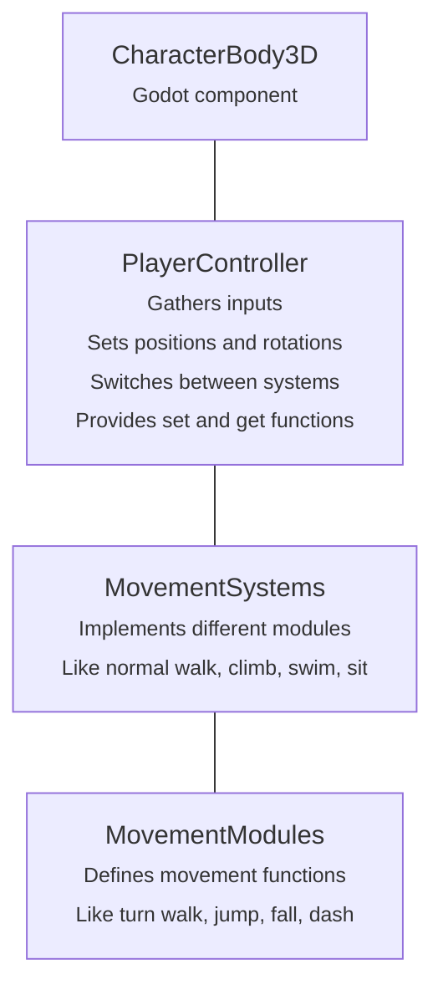

# CharacterControllerForGodot

```mermaid
flowchart TD
    %% User interaction
    CharacterBody3D["CharacterBody3D"<br><span style='font-size: 0.8em;'>Godot component]
    PlayerController["PlayerController"<br><span style='font-size: 0.8em;'>Gathers inputs<br>Sets positions and rotations<br>Switches between systems<br>Provides set and get functions]
    MovementSystems["MovementSystems"<br><span style='font-size: 0.8em;'>Implements different modules<br>Like normal walk, climb, swim, sit]
    MovementModules["MovementModules"<br><span style='font-size: 0.8em;'>Defines movement functions<br>Like turn walk, jump, fall, dash]
    CharacterBody3D --- PlayerController
    PlayerController --- MovementSystems
    MovementSystems --- MovementModules
    
```